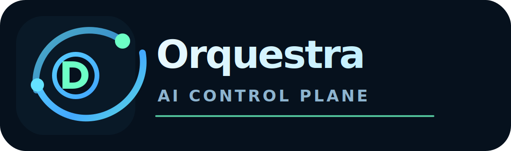

# Orquestra



`Orquestra` e uma plataforma macOS-first para operar IA local e remota em um unico control plane. A aplicacao concentra chat multi-provider, memoria evolutiva, RAG local, leitura multimodal de diretorios, dashboard operacional, registry de modelos e preparacao de jobs de treino em uma superficie web e desktop.

## Objetivo
O objetivo do Orquestra e transformar o Mac em uma central de coordenacao local-first para projetos de IA. Ele deve permitir conversar com modelos locais e remotos, anexar e entender workspaces inteiros, manter continuidade de sessao, consultar conhecimento RAG, acompanhar servicos e preparar evolucao de modelos sem depender implicitamente do antigo repositorio `Local_RAG`.

Principios do projeto:
- `local-first`: a API, o banco, os artefatos, o MemoryGraph e o workspace multimodal rodam localmente por padrao.
- `macOS-first`: o fluxo oficial usa app desktop Tauri, LaunchAgent de usuario e instalador/desinstalador em shell.
- `web + desktop`: a mesma interface React/Vite funciona no navegador e dentro do shell macOS.
- `provider-agnostic`: os providers passam por um gateway unico, com suporte a LM Studio, OpenAI, Anthropic, DeepSeek, Ollama e LiteLLM.
- `inventory-first`: diretorios grandes sao inventariados primeiro; extracao e indexacao pesada acontecem sob demanda.
- `sem segredos no repo`: credenciais ficam fora do Git, usando `.env` local ou mecanismos seguros do macOS.

## Recursos
### Chat multi-provider
- Interface unica para conversar com modelos locais e remotos.
- Nova sessao com setup curto de objetivo, preset operacional e politica de memoria/RAG.
- Painel lateral `Memoria & RAG` dentro do chat para ajustar objetivo, preset, RAG, workspace e modo dataset sem abandonar a conversa.
- Providers suportados no catalogo:
  - `LM Studio`
  - `OpenAI`
  - `Anthropic`
  - `DeepSeek`
  - `Ollama`
  - `LiteLLM Proxy`
- Alternancia de provider/modelo por projeto.
- Streaming por SSE no backend.
- Modo mock/local-safe para validar sem depender de API externa.

### MemoryGraph
- Transcript bruto em JSONL por sessao.
- Resumo estruturado de sessao separado do transcript.
- `Session Profile` salvo em `ChatSession.metadata_json`, com `objective`, `preset`, `memory_policy`, `rag_policy` e `persona_config`.
- Memoria duravel por topicos e escopos.
- `Memory Inbox` com candidatos revisaveis antes de qualquer promocao duravel.
- Recall semantico com fallback lexical.
- Promocao manual de fatos/contextos para memoria.
- Training candidates para preparar datasets futuros somente depois de aprovacao explicita.
- Resume de sessao para retomar continuidade operacional.

### Workspace Multimodal
- Anexo de diretorios inteiros.
- Inventario recursivo com hash, MIME, extensao, tamanho e caminho relativo.
- Classificacao de ativos:
  - `code_text`
  - `image`
  - `pdf`
  - `office`
  - `audio`
  - `video`
  - `binary`
- Extracao sob demanda:
  - texto/codigo: leitura textual e indexacao leve;
  - imagem: metadados e thumbnail;
  - PDF: texto das paginas iniciais;
  - Office: `docx`, `xlsx` e `pptx`;
  - audio: metadados e transcricao opcional via `whisper`;
  - video: metadados, poster frame opcional via `ffmpeg` e transcricao opcional.
- Preview e abertura no app padrao do macOS.
- Promocao de ativos relevantes para memoria.

### RAG local
- Consulta ao engine RAG embutido.
- Colecao Chroma `orquestra_memory_v1` para memoria aprovada associada ao RAG.
- Recall de chat com orcamento pequeno: memoria aprovada, resumo operacional e fontes locais quando disponiveis.
- Fallback lexical quando Chroma, embeddings ou colecoes estiverem indisponiveis.
- Integracao com o gateway multi-provider.
- Persistencia local de interacoes quando solicitado.
- Modo mock para smoke tests.

### Dashboard operacional
Web e desktop exibem o mesmo painel com:
- servicos essenciais;
- listeners locais;
- processos em background;
- sessoes recentes;
- scans de workspace;
- memoria e training candidates;
- candidatos pendentes de revisao no `Memory Inbox`;
- providers, conectores, jobs e registry;
- artefatos de build, app, DMG, instalador e desinstalador;
- acoes operacionais disparaveis pela UI.

### Train Ops e Registry
- Catalogo de conectores:
  - `ec2`
  - `sagemaker_notebook_job`
  - `kaggle_kernel`
  - `databricks_job`
- Registro de jobs locais/remotos como intencao operacional.
- Registry de modelos/adapters por projeto.
- Comparacao simples de benchmarks entre baseline e candidate.
- Nesta fase, execucao remota real continua adiada; os conectores funcionam como catalogo, readiness e fila local.

### Instalacao macOS
- Instalador script-first em `scripts/install_orquestra_macos.sh`.
- Desinstalador em `scripts/uninstall_orquestra_macos.sh`.
- Build do app Tauri e instalacao em `~/Applications/Orquestra AI.app`.
- LaunchAgent de usuario para manter a API local disponivel.
- Runtime espelhado em `~/Library/Application Support/Orquestra/runtime`, evitando depender do caminho do repositorio depois de instalado.
- Backup automatico do banco local antes de upgrades com sync de runtime.
- Manifesto de instalacao em `experiments/orquestra/install/install_manifest.json`.
- Desinstalacao preserva dados por padrao e oferece `--purge-data` quando necessario.

## Estrutura
- `orquestra_ai/`: backend FastAPI, MemoryGraph, Workspace Multimodal, gateway, registry, operations e jobs.
- `orquestra_web/`: frontend React/Vite e shell desktop Tauri.
- `rag/`: engine RAG local integrado ao backend.
- `training/local/`: utilitarios compartilhados de ingestao e avaliacao.
- `scripts/`: bootstrap, validacao, API, web, desktop, instalacao e desinstalacao.
- `assets/brand/`: logo e assinatura visual do Orquestra.
- `docs/`: instalacao, arquitetura e manual operacional.

## Estado atual
- Backend, frontend web e shell desktop estao integros no fluxo local.
- `./scripts/validate_orquestra.sh` e a verificacao automatizada principal.
- O build desktop do Tauri fecha localmente no macOS e gera `.app` + `.dmg`.
- `./scripts/validate_orquestra_macos_package.sh` valida bundle, DMG, `Info.plist`, scripts e assinatura local/ad-hoc.
- Chat, memoria, RAG e Workspace Multimodal passam em smoke local.
- Sessao com objetivo/preset, memoria revisavel, aprovacao de candidato e recall RAG associado estao integrados na V1 local.
- Providers reais sao opcionais; a validacao usa modo mock/local-safe.
- Dashboard operacional, instalador, desinstalador e manual estao documentados.
- `/api/health` e o dashboard expõem `app_version`, `schema_version`, `schema_target_version`, estado de migração, manifesto e backups recentes.
- EC2 e demais conectores remotos permanecem para fase posterior.

## Requisitos
- macOS
- `python3`, preferencialmente `python3.12`
- `node` + `npm`
- `rustup` + `cargo`
- opcionais:
  - `LM Studio`
  - `ffmpeg`
  - `ffprobe`
  - `whisper`
  - `Ollama`
  - `LiteLLM Proxy`

## Inicio rapido
```bash
cd /caminho/para/Orquestra
./scripts/bootstrap_orquestra.sh
./scripts/validate_orquestra.sh
```

Rodar API:
```bash
./scripts/start_orquestra_api.sh
```

Rodar web:
```bash
./scripts/start_orquestra_web.sh
```

Rodar desktop:
```bash
./scripts/start_orquestra_desktop.sh
```

Buildar, abrir e verificar o app desktop:
```bash
./script/build_and_run.sh --verify
```

## Instalar no macOS
```bash
cd /caminho/para/Orquestra
./scripts/install_orquestra_macos.sh
```

Opcoes:
```bash
./scripts/install_orquestra_macos.sh --skip-build
./scripts/install_orquestra_macos.sh --no-launch-agent
./scripts/install_orquestra_macos.sh --no-runtime-sync
./scripts/install_orquestra_macos.sh --open
./scripts/install_orquestra_macos.sh --no-wait-api
./scripts/install_orquestra_macos.sh --skip-package-verify
./scripts/install_orquestra_macos.sh --install-dir "$HOME/Applications/Orquestra AI.app"
```

O instalador prepara o ambiente, gera o app desktop, valida o pacote local, instala o bundle em `~/Applications`, sincroniza o runtime para `~/Library/Application Support/Orquestra/runtime` e registra o LaunchAgent `ai.orquestra.api`.
Para Macs mais lentos no primeiro boot, ajuste `ORQUESTRA_INSTALL_API_WAIT_SECONDS=120` antes de instalar.
Cada upgrade com sync de runtime cria backup do banco em `~/Library/Application Support/Orquestra/runtime/experiments/orquestra/install/backups`.
Use `ORQUESTRA_INSTALL_BACKUP_LIMIT=8` para alterar a retenção padrão de 5 backups.

Artefatos gerados:
- `orquestra_web/src-tauri/target/release/bundle/macos/Orquestra AI.app`
- `orquestra_web/src-tauri/target/release/bundle/dmg/Orquestra AI_0.2.0_aarch64.dmg`

## Desinstalar no macOS
```bash
cd /caminho/para/Orquestra
./scripts/uninstall_orquestra_macos.sh
```

Remover tambem dados e logs:
```bash
./scripts/uninstall_orquestra_macos.sh --purge-data
./scripts/uninstall_orquestra_macos.sh --no-launch-agent
```

## Enderecos locais
- API: `http://127.0.0.1:8808`
- Web: `http://127.0.0.1:4177`
- App: `~/Applications/Orquestra AI.app`
- Logs instalados: `~/Library/Logs/Orquestra`
- Dados de suporte: `~/Library/Application Support/Orquestra`
- Runtime instalado: `~/Library/Application Support/Orquestra/runtime`
- Manifesto de instalacao: `~/Library/Application Support/Orquestra/runtime/experiments/orquestra/install/install_manifest.json`
- Backups de upgrade: `~/Library/Application Support/Orquestra/runtime/experiments/orquestra/install/backups`

## Documentacao
- [Manual operacional completo](docs/02-manual-operacional.md)
- [Instalacao e validacao macOS](docs/01-instalacao-validacao-macos.md)
- [Orquestra AI Control Plane](docs/11-orquestra-ai-control-plane.md)
- [Orquestra V2 MemoryGraph Workspace](docs/12-orquestra-v2-memorygraph-workspace.md)

## Marca
- Logo: `assets/brand/orquestra-logo.svg`
- Wordmark: `assets/brand/orquestra-wordmark.svg`
- A UI desktop/web usa a mesma marca em `orquestra_web/src/assets/orquestra-logo.svg`.

## Seguranca
- Nunca versionar `.env` real, chaves privadas ou credenciais.
- Usar `.env.example` como referencia.
- Preferir `LM Studio` e modo mock para validacao local.
- Ativar providers remotos somente quando as chaves estiverem configuradas fora do Git.
- Manter a integracao EC2 adiada ate existir alvo remoto e politica de execucao aprovada.
